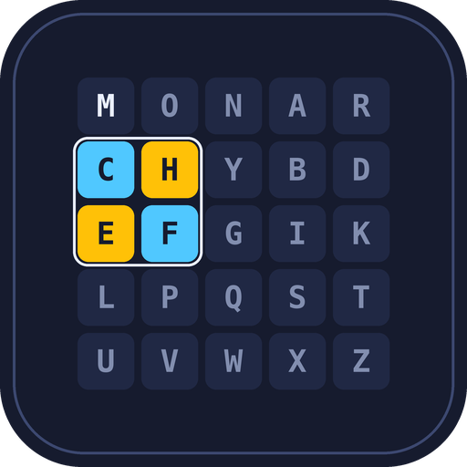
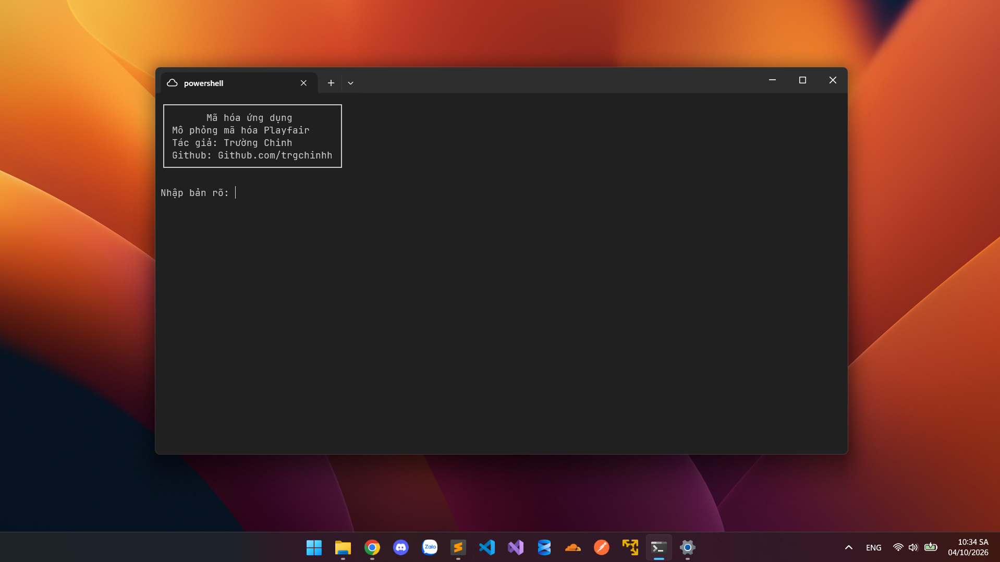

# TRIỂN KHAI MÃ HÓA PLAYFAIR 14x14 BẰNG C#

<p align="center">
  
</p>

<p align="center">
  <a href="https://github.com/trgchinhh">
    
  </a>
  <a href="LICENSE">
    
  </a>
  <a href="https://github.com/trgchinhh">
    
  </a>
</p>

Chương trình nhỏ mô phỏng thuật toán mã hóa Playfair (mã hóa theo cặp ký tự) bản nâng cấp tự build: bảng 14x14, xáo trộn cặp đối xứng sau khi mã hóa, rồi quay phải n ký tự



---

## Giới thiệu

- **Mã hóa Playfair:** là thuật toán mã hóa cổ điển dùng bảng ký tự vuông, ở đây nâng từ 5x5 lên 14x14
  - Nguyên tắc: bản rõ được chia thành từng cặp ký tự, mỗi cặp được thay bằng 1 cặp khác dựa trên vị trí của 2 ký tự trong bảng 14x14 sinh từ từ khóa
  - Mã hóa thì dịch tiến (phải/xuống), giải mã thì dịch lùi (trái/lên)
  - Sau bước thay thế còn thêm 2 bước hoán vị: đảo đối xứng thứ tự các cặp + quay phải n ký tự
  - => Mã hóa theo cặp nên che được tần suất xuất hiện của từng ký tự đơn lẻ, khó phá hơn Ceasar
  - => Dùng chung từ khóa K và số n cho cả 2 chiều nên đây vẫn là mã hóa đối xứng (dùng 1 khóa)

---

## Thành phần

- `P`: nội dung (bản rõ)
- `C`: nội dung sau mã hóa (bản mã)
- `K`: từ khóa (keyword) dùng để sinh bảng 14x14
- `n`: số ký tự quay phải (nhập vào, lấy n mod độ dài bản mã)
- `M`: ma trận 14x14 chứa 196 ký tự khác nhau (bảng ký tự `bangkytu`)
- `(r, c)`: tọa độ hàng, cột của ký tự trong ma trận M

---

## Bảng ký tự `bangkytu`

196 ký tự = 14 x 14, theo thứ tự:

| Nhóm | Ký tự | Số lượng |
|---|---|---|
| Chữ hoa Latin | `A -> Z` | 26 |
| Chữ số | `0 -> 9` | 10 |
| Chữ hoa tiếng Việt | `Đ` + `À Á Ả Ã Ạ` + `Ă Ằ Ắ Ẳ Ẵ Ặ` + `Â Ầ Ấ Ẩ Ẫ Ậ` + `È É Ẻ Ẽ Ẹ` + `Ê Ề Ế Ể Ễ Ệ` + `Ì Í Ỉ Ĩ Ị` + `Ò Ó Ỏ Õ Ọ` + `Ô Ồ Ố Ổ Ỗ Ộ` + `Ơ Ờ Ớ Ở Ỡ Ợ` + `Ù Ú Ủ Ũ Ụ` + `Ư Ừ Ứ Ử Ữ Ự` + `Ỳ Ý Ỷ Ỹ Ỵ` | 67 |
| Chữ thường Latin | `a -> z` | 26 |
| Chữ thường tiếng Việt | `đ` + `à á ả ã ạ` + ... + `ỳ ý ỷ ỹ ỵ` (tương ứng chữ hoa) | 67 |

=> 26 + 10 + 67 + 26 + 67 = **196**

---

## Cách tạo ma trận 14x14

- Viết từ khóa K vào ma trận từng ký tự theo hàng, bỏ ký tự trùng lặp
- Điền tiếp các ký tự còn lại trong `bangkytu` (theo đúng thứ tự trong bảng) vào các ô trống
- Phân biệt hoa/thường, có dấu/không dấu là các ký tự khác nhau, không gộp ký tự nào

---

## Chuẩn hóa bản rõ

- Bỏ ký tự không thuộc `bangkytu` (khoảng trắng, dấu câu...), giữ nguyên hoa/thường
- Chia bản rõ thành từng cặp 2 ký tự
- Nếu 2 ký tự trong cặp giống nhau -> chèn thêm `X` vào giữa (VD: LL -> LX L...)
- Nếu số ký tự lẻ -> thêm `X` vào cuối để đủ cặp

---

## Các quy tắc biến đổi (cho mỗi cặp ký tự)

- **Cùng hàng:** mỗi ký tự lấy ký tự bên phải nó (giải mã: bên trái), hết hàng thì quay về đầu hàng
- **Cùng cột:** mỗi ký tự lấy ký tự bên dưới nó (giải mã: bên trên), hết cột thì quay về đầu cột
- **Khác hàng khác cột (hình chữ nhật):** mỗi ký tự lấy ký tự cùng hàng của mình nhưng nằm ở cột của ký tự còn lại (mã hóa và giải mã giống nhau)

---

## Công thức thay thế (mã hóa)

Cặp `P1 P2 -> C1 C2`, N = 14

```
Cùng hàng (r1 = r2):  C1 = M[r1][(c1 + 1) mod 14],  C2 = M[r2][(c2 + 1) mod 14]
Cùng cột  (c1 = c2):  C1 = M[(r1 + 1) mod 14][c1],  C2 = M[(r2 + 1) mod 14][c2]
Hình chữ nhật:        C1 = M[r1][c2],               C2 = M[r2][c1]
```

---

## Công thức giải mã thay thế

Cặp `C1 C2 -> P1 P2`

```
Cùng hàng (r1 = r2):  P1 = M[r1][(c1 - 1 + 14) mod 14],  P2 = M[r2][(c2 - 1 + 14) mod 14]
Cùng cột  (c1 = c2):  P1 = M[(r1 - 1 + 14) mod 14][c1],  P2 = M[(r2 - 1 + 14) mod 14][c2]
Hình chữ nhật:        P1 = M[r1][c2],                    P2 = M[r2][c1]
```

---

## Xáo trộn cặp đối xứng (sau khi thay thế)

- Bản mã gồm các cặp: `[S0][S1][S2]...[S(m-1)]`
- Cặp thứ i đổi chỗ với cặp thứ (m - 1 - i): cặp đầu <-> cặp cuối, cặp thứ 2 <-> cặp áp chót...
- Thứ tự 2 ký tự bên trong mỗi cặp giữ nguyên
- Phép đảo đối xứng tự nghịch đảo: làm lại 1 lần là về như cũ

---

## Quay phải n ký tự (sau khi xáo trộn)

- Lấy `n' = n mod độ dài bản mã`, chuyển `n'` ký tự cuối lên đầu chuỗi
- Giải mã: quay trái `n'` ký tự (ngược lại)

---

## Quy trình

```
Mã hóa:  P -> chuẩn hóa -> thay thế theo cặp -> đảo đối xứng các cặp -> quay phải n ký tự -> C
Giải mã: C -> quay trái n ký tự -> đảo đối xứng các cặp -> giải mã thay thế -> bỏ X chèn thêm -> P
```

---

## Ví dụ


Bản rõ P = "HELLO"
Từ khóa: K = "MONARCHY", n = 2

```
Ma trận 14x14:
  M  O  N  A  R  C  H  Y  B  D  E  F  G  I
  J  K  L  P  Q  S  T  U  V  W  X  Z  0  1
  2  3  4  5  6  7  8  9  Đ  À  Á  Ả  Ã  Ạ
  Ă  Ằ  Ắ  Ẳ  Ẵ  Ặ  Â  Ầ  Ấ  Ẩ  Ẫ  Ậ  È  É
  Ẻ  Ẽ  Ẹ  Ê  Ề  Ế  Ể  Ễ  Ệ  Ì  Í  Ỉ  Ĩ  Ị
  Ò  Ó  Ỏ  Õ  Ọ  Ô  Ồ  Ố  Ổ  Ỗ  Ộ  Ơ  Ờ  Ớ
  Ở  Ỡ  Ợ  Ù  Ú  Ủ  Ũ  Ụ  Ư  Ừ  Ứ  Ử  Ữ  Ự
  Ỳ  Ý  Ỷ  Ỹ  Ỵ  a  b  c  d  e  f  g  h  i
  j  k  l  m  n  o  p  q  r  s  t  u  v  w
  x  y  z  đ  à  á  ả  ã  ạ  ă  ằ  ắ  ẳ  ẵ
  ặ  â  ầ  ấ  ẩ  ẫ  ậ  è  é  ẻ  ẽ  ẹ  ê  ề
  ế  ể  ễ  ệ  ì  í  ỉ  ĩ  ị  ò  ó  ỏ  õ  ọ
  ô  ồ  ố  ổ  ỗ  ộ  ơ  ờ  ớ  ở  ỡ  ợ  ù  ú
  ủ  ũ  ụ  ư  ừ  ứ  ử  ữ  ự  ỳ  ý  ỷ  ỹ  ỵ
```

Chuẩn hóa: HELLO -> HE LX LO   (chèn X giữa cặp LL giống nhau)

Mã hóa:
  Thay thế:
    HE: H(0,6), E(0,10) -> cùng hàng     -> Y(0,7) F(0,11)  => YF
    LX: L(1,2), X(1,10) -> cùng hàng     -> P(1,3) Z(1,11)  => PZ
    LO: L(1,2), O(0,1)  -> hình chữ nhật -> K(1,1) N(0,2)   => KN
    -> "YF PZ KN" = "YFPZKN"
  Đảo đối xứng cặp: [YF][PZ][KN] -> [KN][PZ][YF] => "KNPZYF"
  Quay phải 2 ký tự: "KNPZYF" -> "YF" + "KNPZ"    => C = "YFKNPZ"

Giải mã:
  Quay trái 2 ký tự: "YFKNPZ" -> "KNPZYF"
  Đảo đối xứng cặp:  [KN][PZ][YF] -> [YF][PZ][KN]
    YF: Y(0,7), F(0,11) -> cùng hàng     -> H(0,6) E(0,10)  => HE
    PZ: P(1,3), Z(1,11) -> cùng hàng     -> L(1,2) X(1,10)  => LX
    KN: K(1,1), N(0,2)  -> hình chữ nhật -> L(1,2) O(0,1)   => LO
  -> HELXLO -> bỏ X chèn thêm -> P = "HELLO"


---

## Đút kết

- Vẫn chỉ dùng 1 từ khóa K (cùng số n) cho cả mã hóa và giải mã nên là mã hóa đối xứng
- Bảng 14x14 có 196 x 196 = 38416 cặp khả dĩ (so với 625 của 5x5) nên phân tích tần suất cặp khó hơn nhiều
- Hỗ trợ cả chữ hoa, chữ thường, chữ số và tiếng Việt có dấu, không phải gộp I/J hay bỏ dấu
- Đảo cặp đối xứng + quay phải n ký tự làm bản mã mất thứ tự cặp gốc, che luôn quy luật vị trí

```
        MÃ HÓA              │       GIẢI MÃ
     ───────────────────────┼───────────────────────
      - từ khóa K, số n     │    - từ khóa K, số n
      - bản rõ P            │    - bản mã C
      - thay thế theo cặp   │    - quay trái n ký tự
      - đảo đối xứng cặp    │    - đảo đối xứng cặp
      - quay phải n ký tự   │    - thay thế ngược theo cặp
      - ra C                │    - ra P
```

---

## Cách cài đặt

```bash
git clone https://github.com/trgchinhh/Playfair-encryption.git
cd ./Playfair-encryption
dotnet run
```

---

## Tác giả
**Nguyễn Trường Chinh (NTC++)**<br>
**GitHub:** [https://github.com/trgchinhh](https://github.com/trgchinhh)

---

> 📌 Dự án nhỏ được phát triển với mục đích học tập và nghiên cứu. Mọi góp ý và đóng góp đều được hoan nghênh.